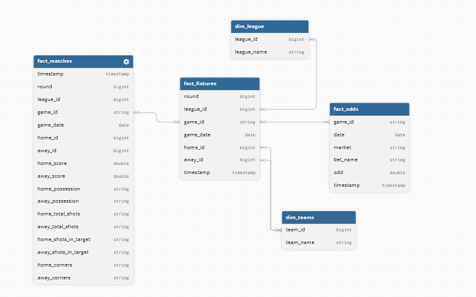

<p align="center">

  

  

  

  

  
</p>

<h1 align="center">Betool</h1>
<h3 align="center">Pipeline automatizado de MLOps y motor XGBoost para identificar apuestas deportivas de valor (+EV).</h3>


## Sobre el proyecto
Betool es una herramienta de ingeniería de datos diseñada para extraer estadísticas, cuotas deportivas normalizadas y ejecutar modelos de Machine Learning para encontrar ineficiencias matemáticas (EV+) en casas de apuestas. Utilizando arquitectura serverless híbrida enfocando la recolección de datos en la nube separada de un entrenamiento analitico local, optimizando costos operativos y aplicando una gestión de capital (bankroll) mediante el Criterio de Kelly.

## Arquitectura y lógica
El proyecto alimenta principalmente los dos entornos a través de un Data Lake en Amazon S3:

1. **Data (AWS FARGATE):** Un contenedor docker ligero se ejecuta diariamente en la nube para extraer datos de plataformas deportivas mediante `curl_cffi`, alineando los nombres de los equipos con las casas de apuestas mediante `RapidFuzz`, con ello almacena la información bruta en S3.

2. **Análisis (local):** El entorno local consulta el historial, descarga y entrena modelos de XGBoost, generando un .csv con las mejores apuestas disponibles.

### Estructura de Datos en Athena
Utiliza AWS Athena como motor SQL principal para limpiar y consultar los archivos crudos de S3. El schema de las tablas es:



Junto a ello se utilizan varias vistas:
* `v_matches`: Registro histórico sin duplicados y utilizando los datos mas recientes de resultados.
* `v_fixtures`: Calendario de partidos futuros basado en el dato más reciente.
* `v_odds`: Registro de mercados y apuestas disponibles con su valor más reciente.


## Uso basico (Usuarios)

Este proyecto está orientado a levantar tu propio bot en la nube por ello debes desplegar tus servicios en AWS usando tus propias credenciales antes de consultar y generar predicciones.


1. Clona el repositorio
```bash
git clone [https://github.com/Dracosk/betool.git](https://github.com/Dracosk/betool.git)
cd betool
```

2. Crea tu Entorno virtual e instala dependencias de ML
```bash
py -m venv venv
source venv/bin/activate # O venv/Scripts/Activate en Windows
pip install -r requirements_ml.txt
```
3. Conecta tus credenciales mediante .aws o .env (ignoradas en Git por seguridad).

4. Ejecuta main para obtener predicciones:
```
py -m main bot
```

## Despliegue para desarrolladores

1. Crear un bucket en S3 con las carpetas para cada tabla, modelos y para los resultados de la query.

2. Configura un rol IAM con una política estricta en formato JSON que sólo permita obtener o poner objetos y consultas athenas exclusivas para tu bucket:
```JSON
{
    "Version": "2012-10-17",
    "Statement": [
        {
            "Sid": "S3StrictAccess",
            "Effect": "Allow",
            "Action": [
                "s3:ListBucket",
                "s3:GetBucketLocation",
                "s3:PutObject",
                "s3:GetObject",
                "s3:DeleteObject"
            ],
            "Resource": [
                "arn:aws:s3:::<TU-NOMBRE-DE-BUCKET>",
                "arn:aws:s3:::<TU-NOMBRE-DE-BUCKET>/*"
            ]
        },
        {
            "Sid": "AthenaQueryAccess",
            "Effect": "Allow",
            "Action": [
                "athena:StartQueryExecution",
                "athena:GetQueryExecution",
                "athena:GetQueryResults",
                "athena:StopQueryExecution",
                "athena:GetWorkGroup"
            ],
            "Resource": "arn:aws:athena:<TU-REGION>:<TU-ACCOUNT-ID>:workgroup/primary"
        },
        {
            "Sid": "GlueCatalogAccess",
            "Effect": "Allow",
            "Action": [
                "glue:GetDatabase",
                "glue:GetDatabases",
                "glue:GetTable",
                "glue:GetTables",
                "glue:GetPartition",
                "glue:GetPartitions",
                "glue:CreateTable", 
                "glue:UpdateTable", 
                "glue:DeleteTable" 
            ],
            "Resource": [
                "arn:aws:glue:<TU-REGION>:<TU-ACCOUNT-ID>:catalog",
                "arn:aws:glue:<TU-REGION>:<TU-ACCOUNT-ID>:database/<TU-BASE-DE-DATOS>",
                "arn:aws:glue:<TU-REGION>:<TU-ACCOUNT-ID>:table/<TU-BASE-DE-DATOS>/*"
            ]
        }
    ]
}
```
* `<TU-NOMBRE-DE-BUCKET>`: el nombre del bucket S3 que creaste.
* `<TU-REGIÓN>`: la región donde levantaste los servicios.
* `<TU-ACCOUNT-ID>`: el número de cuenta de aws 12 dígitos (lo encuentras arriba a la derecha en la consola).
* `<TU-BASE-DE-DATOS>`: el nombre de tu base de datos en Athena
* `glue:CreateTable`,`glue:UpdateTable` y `glue:DeleteTable` son opcionales por si luego quieres compactar los archivos .parquet.

3. Compila la imagen optimizada y súbelo a Amazon ECR:
```bash
docker build -t <NOMBRE-DE-TU-REPO> .
```
* **Asegúrate** de no mezclar `requirements_ml.txt` con `requirements.txt` este último está destinado a AWS para no impactar el peso de los contenedores.

4. Finalmente configura una tarea en ECS Fargate para ejecutar `py -m main` y programarla mediante EventBridge.

## Contribuciones
Toda mejora a la arquitectura o al rendimiento de modelos es bienvenida.

Principalmente me encuentro trabajando en mejorar los modelos y la ingesta de datos migrando a otro proveedor de estadísticas.

## Problemas Conocidos
* **Extracción de la Bundesliga**: Actualmente presenta problemas al scrapear los partidos de esta temporada, debido a inconsistencias en el proveedor de datos.
* **El archivo season** Si bien funciona, entrega datos incompletos en ciertos casos. (También se soluciona con un nuevo proveedor).


## Advertencia

Betool es un proyecto con fines educativos. Las predicciones generadas no son consejos financieros. Las apuestas deportivas conllevan un alto riesgo, juega de manera responsable.


